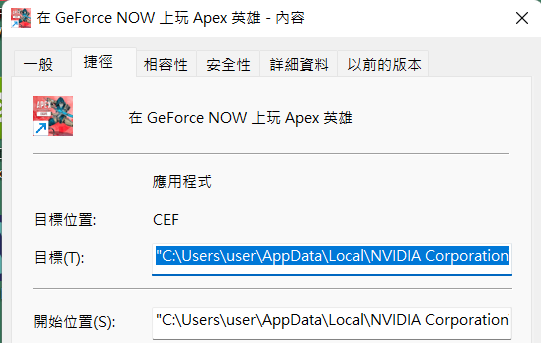

# GFN Notifier
## English version summary
Used with [GFN Queue Tracker](https://github.com/Kaiserouo/GFN-Queue-Tracker). This is a web API for returning GeForce NOW's current queue count on this computer.

Demo video (Traditional Chinese): https://youtu.be/jcujfVqw4Y0

Supports:
+ Returning GeForce NOW's current queue count (`http://<ip>:<port>/gfnviewer`)
+ Open Geforce NOW (`http://<ip>:<port>/gfnopener`)
+ Open TeamViewer (`http://<ip>:<port>/tvopener`)

Note that it was meant to be used with VPN:
1. Install LogMeIn Hamachi or other VPN on your computer
2. Try to make your phone connect to the same VPN.
3. Adjust config in `main.py`, especially `VPN_SERVER_IP`.
4. Run `python main.py` with this folder as current working directory.

Preferrably use private (enough) VPN for this server, since it uses flask, which is not really meant for productive usage.

## Traditional Chinese Version
搭配[GFN Queue Tracker](https://github.com/Kaiserouo/GFN-Queue-Tracker)一起使用。
這是用來當做一個API，回傳GeForce NOW目前排隊人數用的。

Demo video: https://youtu.be/jcujfVqw4Y0

## Prerequisites & Setup
### Tesseract
> 如果用舊版的偵測方式 (GFNViewerTesseract) 的話
請裝最新版 (> 5.0)。
**請確認有安裝到繁體中文`chi_tra`的檔案！** 也就是安裝完之後，應該會有檔案`<your_path>/Tesseract-OCR/tessdata/chi_tra.traineddata`

請確認環境變數有設定正確：
+ 安裝完之後，`tesseract.exe`必須在系統環境變數`PATH`的其中資料夾裡面。
  + i.e. `PATH`要新增一條`<your_path>/Tesseract-OCR`。或說在命令列打`tesseract`可以找的到程式執行。
+ 系統環境變數`TESSDATA_PREFIX`必須是裝`.traineddata`的資料夾。
  + 應該會是`<your_path>/Tesseract-OCR/tessdata`。

### TeamViewer
因為有各種因素可能會出問題，所以給予遠端透過此伺服器開啟TeamViewer開啟的選項。如果你出門前忘了開TeamViewer可以透過一次性要求的API開起來。

### VPN
因為家裡電腦八成沒有public IP，需要弄一個VPN出來。
1. 安裝LogMeIn Hamachi並創建一個VPN網路。
2. 讓手機也可以連上這個VPN網路。
3. 更改一下`main.py`關於VPN的config。

手機連LogMeIn Hamachi的教學官方有。Config的部分參考下面。
如果你有自己的VPN的話也可以用。

### Other Python Module
ref. `requirements.txt`

## How to use
1. `python main.py`
2. 給你的手機的GFN Queue Tracker設定網址，應該會是長`http://<vpn_ip>:<vpn_port>/<name>`這種形式。
    + 如果是tracker的話，`<name>`是`gfnviewer`。
    + 如果是一次性要求(request list)的話，請直接看code。

假設IP是`25.8.47.6`，port是12000的話 (請自行更改)，目前支援的如下：
+ 隊伍數量追蹤器: `http://25.8.47.6:12000/gfnviewer`
+ 遠端開啟GFN: `http://25.8.47.6:12000/gfnopener`
+ 遠端開啟TeamViewer: `http://25.8.47.6:12000/tvopener`

注意在GFN Queue Tracker追蹤的時候 / 使用`/gfnviewer`的時候，如果GFN被最小化的話他會把他叫回來。這是因為需要截圖：**GFN可以被其他視窗擋住沒關係，但是不能最小化**。我的截圖方法即使被擋住也可以截，所以不需要讓GFN一直顯示在最上層。

## Config
### VPN
基本上是為了執行後自動開啟VPN用的。綁定LogMeIn Hamachi。
+ `TOGGLE_VPN`: 要不要自動開啟/關閉VPN。**如果你用其他的VPN (或不用VPN) 的話，設成`False`然後只須改下面的IP和port即可。**
+ `VPN_NAME`: 你創的VPN網路的名子。
+ `VPN_SERVER_IP`: 在那個VPN網路裡，本台電腦的IP。其實就是網路伺服器IP。
+ `VPN_SERVER_PORT`: 網路伺服器的port。
+ `HAMACHI_PATH`: Hamachi的CLI的path。

### GFN
+ `GFN_SEARCH_STRING`: 找GFN視窗的時候用來對應的子字串，如果找到的視窗數不等於1的話都會回傳失敗。
  + 你可以在`main.py`的視窗裡看到搜尋到的視窗有什麼。那個list應該只有一個東西才對。
+ `GFN_START_COMMAND`: 用來開啟遊戲用的。不想遠端開啟遊戲的話不改也沒關係。
  + 請在GFN裡面把想要的遊戲設成捷徑，然後右鍵 > 內容，把目標複製貼上。


### TeamViewer
用來遠端開啟TeamViewer用的。沒有的話不改也沒關係。
+ `TEAMVIEWER_PATH`: TeamViewer的路徑。

## Developer Note
隊伍數量追蹤器(Queue tracker)回傳
```
{
    "count": integer,
    "message": string
}
```
其中`count`為負時為錯誤或結束。請參考傳的message看看目前狀況。
其實因為GFN進入遊戲後照理來說應該找不到排隊數字，所以會有錯誤(為找不到排隊數字)。請根據GFN Queue Tracker紀錄的History欄位看看是否是錯誤，還是其實真的是人數到了。

其他一次性要求(request list)回傳
```
{
    "code": integer,
    "message": string
}
```
其中`code`為`0`的時候是success，其他都是fail，並且應該要付一個錯誤訊息。

注意每次收到`/gfnviewer`的request時都會截一次圖跑一次OCR，所以其實無法應付大量/間隔短的request。
你是可以另開一個thread然後每隔幾秒截圖OCR更新某個變數，這樣可以應付多request。不過因為是自用所以不用擔心這個。

因為用flask的原因，請不要把這個伺服器真的公開到網路上。我最後能接受用flask的其中一個原因是VPN變相給他一個保護...。